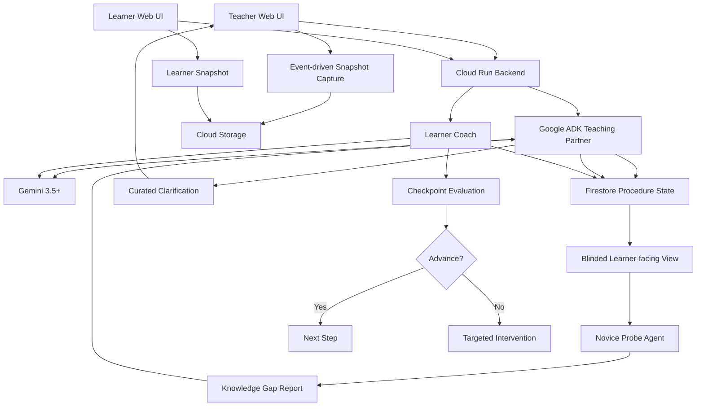

# ByFeel v2 — Revised Hackathon Brief

> **Working title:** ByFeel  
> **Hackathon:** All Things Agentic Hackathon  
> **Target track:** Collaborative Partner  
> **Status:** Revised concept after adversarial review  
> **Date:** 2026-08-09  
> **Purpose:** Handoff document for critics, architects, implementation agents, and hackathon strategists

---

## 0. Executive decision

**KEEP the project, but not the original version unchanged.**

The stronger concept is no longer:

> “An AI that watches someone perform a skill and remembers how they do it.”

It is:

> **An agent that finds what an expert forgot to explain.**

A teacher demonstrates a bounded physical procedure. ByFeel converts that demonstration into structured learner-facing knowledge. A separate **Blinded Novice Probe**, which is intentionally prevented from seeing the teacher's raw demonstration, tries to follow only the knowledge a future learner would receive.

If the probe gets stuck, it identifies the missing execution criterion. ByFeel asks the teacher a targeted clarification, captures new evidence, mutates the procedure, and reruns the test.

Then a real second learner performs the task and is guided using the repaired knowledge.

### Core claim

> **Knowledge acquired from Person A, stress-tested without access to Person A's raw demonstration, visibly changes how the agent guides Person B.**

That closed loop is the project.

Everything else supports it.

---

# 1. One-sentence pitch

> **ByFeel watches an expert demonstrate a skill, stress-tests the instructions through a blinded novice agent, asks only about the knowledge the expert forgot to explain, and then uses the repaired procedure to guide someone else.**

Short version:

> **An agent that finds what an expert forgot to explain.**

Demo hook:

> **Teach it once. It checks whether what you taught is actually teachable.**

---

# 2. Why the concept changed

The original concept had strong ingredients:

- multimodal interaction;
- persistent memory;
- human correction;
- teacher-to-learner transfer;
- clear Collaborative Partner alignment;
- strong visual demo potential.

Adversarial review exposed real weaknesses:

1. “Learns from your corrections” is already close to the hackathon's own Collaborative Partner example.
2. Cooking risks being instantly categorized as a recipe assistant.
3. Continuous live visual-state reasoning concentrates demo risk in the least reliable component.
4. A procedure graph alone risks looking like LLM-generated JSON.
5. Asking clarifying questions during every vague statement could become annoying.
6. A single-agent system left a genuine multi-role opportunity unused.
7. The idea needed one distinctive mechanism judges could remember.
8. The initial scoring was too optimistic before any prototype existed.

The revised design therefore adds:

- **Blinded Novice Probe**;
- **architecturally enforced information separation**;
- **event-driven snapshots**;
- **post-demonstration question curation**;
- **procedure stress-testing**;
- **actual knowledge diffs instead of version-number theater**;
- **domain selection based on checkpoint reliability**;
- **earlier kill gates and conservative scoring**.

---

# 3. Track fit

## Proposed track: Collaborative Partner

The track asks for an agent that:

- leads the interaction;
- asks clarifying questions;
- guides the user;
- captures feedback;
- adapts to the user;
- maintains useful state across interactions.

ByFeel fits because it does not simply generate a static guide.

It:

1. observes the teacher;
2. constructs procedure state;
3. identifies potentially missing knowledge;
4. stress-tests the procedure;
5. decides which gaps matter;
6. asks targeted clarification;
7. captures corrections;
8. mutates persistent state;
9. applies that repaired state with another person.

---

# 4. Judging-archetype interpretation

The binding rules use three judging archetype names:

- Continuous Action Engine
- Evolving Knowledge Engine
- Multi-Agent Nexus

The public track names are:

- Taskmaster
- Collaborative Partner
- Fortified Enterprise Fleet

The rules do not explicitly declare the following as aliases, but the intended mapping appears strongly implied:

| Public track | Likely judging archetype |
|---|---|
| Taskmaster | Continuous Action Engine |
| Collaborative Partner | Evolving Knowledge Engine |
| Fortified Enterprise Fleet | Multi-Agent Nexus |

Treat this as a **strategic interpretation**, not an official naming statement.

ByFeel aligns well with the Evolving Knowledge framing because it:

- consumes messy multimodal input;
- produces structured knowledge;
- actively mutates that knowledge;
- maintains persistent corrections;
- resolves uncertainty;
- changes future behavior from learned state.

---

# 5. Winning thesis

The winning version is not:

> “AI remembers how you like doing something.”

It is:

> **The agent discovers what is missing from the teacher's explanation, repairs the knowledge through interaction, and proves the repair by using it with another learner.**

The judge-retellable sentence should be:

> “The expert demonstrated the task, then another agent was deliberately blinded from the original demo and tried to follow only the generated instructions. It got stuck, found what the expert forgot to explain, asked the expert one question, repaired the procedure, and then used that knowledge to guide a real learner.”

That is the technical identity.

---

# 6. User problem

Experts often communicate procedures using incomplete instructions:

- “add a little”
- “not too much”
- “until it looks right”
- “tighten it enough”
- “stop when you see this”
- “you'll know when it's ready”
- “do this unless it already looks like that”

The problem is not merely documenting steps.

The problem is discovering the **decision criteria between steps**:

- when to stop;
- when to continue;
- what counts as correct;
- what counts as failure;
- when an exception applies.

A recording preserves what happened.

A transcript preserves what was said.

For physical teaching, neither channel substitutes for the other. A voiced
video requires verbatim audio transcription plus a visual action record. A
silent video requires a visual action record and an explicit statement that the
teacher did not speak. Audio alone cannot establish what was physically done.

A checklist preserves sequence.

But another person can still fail because the expert never articulated the hidden criterion.

---

# 7. Product claim

ByFeel turns a demonstrated procedure into a **debuggable, learner-testable knowledge artifact**.

Core loop:

```text
DEMONSTRATE
    ↓
STRUCTURE
    ↓
IDENTIFY POTENTIAL GAPS
    ↓
BLIND THE NOVICE PROBE
    ↓
ATTEMPT PROCEDURE
    ↓
FIND EXECUTION-BLOCKING MISSING INFORMATION
    ↓
ASK EXPERT
    ↓
CAPTURE CLARIFICATION / EVIDENCE
    ↓
MUTATE PROCEDURE
    ↓
RE-TEST
    ↓
GUIDE REAL LEARNER
```

The innovation is the loop.

Not the camera.

Not memory by itself.

Not the graph by itself.

Not multi-agent count by itself.

---

# 8. Core mechanism: Blinded Novice Probe

The **Blinded Novice Probe** is a distinct reasoning role whose purpose is to test whether the learned procedure is actually sufficient for somebody who did not witness the expert.

It receives only:

- approved learner-facing instructions;
- structured steps;
- approved checkpoint images/descriptions;
- explicit exceptions;
- learner-visible metadata.

It does **not** receive:

- the teacher's raw demonstration;
- hidden narration not committed to the procedure;
- discarded observations;
- private internal notes;
- the original full multimodal session.

This information barrier is critical.

Without it, the probe can cheat.

### Example

Current procedure:

```text
Step 3:
Continue mixing until the consistency is right.
```

Probe:

```text
BLOCKED

Reason:
No observable completion condition exists.

Missing information:
A visible, temporal, or measurable cue distinguishing
“not ready” from “ready”.
```

ByFeel asks:

> “You said to stop when the consistency is right. What should another person look for to know they've reached that point?”

Teacher supplies a reference snapshot and explanation.

Procedure mutates.

Probe reruns.

Now Step 3 passes.

---

# 9. Meaningful agent roles

Do not create five theatrical agents.

There are at most three meaningful roles.

## Teaching Partner

Access:

- teacher session;
- narration;
- snapshots;
- teacher corrections;
- current procedure state.

Responsibilities:

- structure the procedure;
- detect candidate gaps;
- rank gaps;
- ask curated clarification;
- capture checkpoints;
- mutate canonical procedure state.

## Blinded Novice Probe

Restricted access.

Responsibilities:

- attempt the learner-facing procedure;
- identify execution-blocking gaps;
- report ambiguity;
- test whether exceptions are usable;
- produce structured blocker reports.

It cannot mutate canonical state.

## Learner Coach

Access:

- approved procedure;
- learner state;
- approved checkpoints;
- learner snapshots;
- relevant correction history.

Responsibilities:

- guide step-by-step;
- decide advance/block;
- request a new snapshot;
- intervene when state differs;
- fall back to human confirmation when uncertain.

For MVP, Teaching Partner and Learner Coach may share one ADK agent with different modes/tools.

The **Novice Probe should remain logically isolated**.

---

# 10. Why this is honestly agentic

The system makes real decisions.

### Teacher phase

- Is this instruction sufficiently specified?
- Does the ambiguity matter?
- Should the system ask about it?
- What evidence would resolve it?
- Does new feedback replace or augment an old rule?
- Should contradictory instructions be reconciled?

### Stress-test phase

- Can the procedure be followed without hidden context?
- Which step becomes underdetermined?
- What missing variable blocks progress?
- What minimal clarification resolves the blocker?

### Learner phase

- Does the learner satisfy the checkpoint?
- Is confidence high enough to advance?
- Should the agent intervene?
- Should it request another view?
- Should it defer to a human?

---

# 11. Interaction philosophy

## Observe first, interrupt later

The original design risked becoming irritating by reacting to every vague phrase.

Revised behavior:

During the teaching demonstration, ByFeel mostly watches and records candidate gaps.

Example:

```text
"some water"              uncertainty: 0.55
"until it looks right"    uncertainty: 0.92
"not too hard"            uncertainty: 0.40
```

After the demonstration:

1. rank gaps;
2. run novice stress test;
3. ask only the highest-value questions.

Example:

> “I found two places where another person may not know what you mean.”

This should feel selective rather than chatty.

---

# 12. Question-curation policy

Ask only when the missing information is:

- execution-blocking;
- likely to cause learner failure;
- not recoverable from existing evidence;
- not safely inferable;
- not low-value stylistic detail.

Possible heuristic:

```text
priority =
    ambiguity
  × execution_impact
  × learner_failure_probability
  × evidence_gap
```

The exact formula does not matter for MVP.

The product principle does:

> **Ask fewer, better questions.**

---

# 13. Event-driven snapshots

## Decision

Use **event-driven snapshots**, not continuous Gemini video reasoning, for the MVP.

Offline teacher-demo preparation may derive a human-reviewed event transcript
from a bounded recording. That is distinct from continuous live inference: raw
media stays on the teacher side and the blinded probe never receives it.

The browser can still show a live camera preview.

Gemini inference should generally happen on:

- user-confirmed checkpoint capture;
- step transition;
- agent-requested snapshot;
- learner “check my state” action;
- ambiguity-resolution capture;
- correction capture.

Advantages:

- lower latency;
- lower cost;
- easier debugging;
- easier evidence tracing;
- less demo variance;
- simpler Cloud Run architecture;
- cleaner checkpoint comparison.

---

# 14. No Live API dependency

The required Gemini 3.5+ path already supports multimodal inputs, structured output, and tool use.

The winning MVP does not need continuous live video inference.

Do not introduce a second streaming model just to make the camera feel “live.”

If voice streaming is later useful, treat it as an enhancement, not a load-bearing dependency.

---

# 15. Persistent knowledge artifact

Use a structured persistent representation.

Working technical name:

## Procedural Knowledge Graph

The earlier name **Tacit Procedure Graph** is still fine internally, but it should not be sold as the core novelty.

The graph is infrastructure for the closed loop.

---

# 16. Procedure schema

```yaml
procedure:
  id: string
  title: string
  owner_id: string
  domain: string
  created_at: timestamp
  updated_at: timestamp
  status: draft | tested | learner_ready
  steps:
    - step_id: string
      order: integer
      action: string
      prerequisites: []
      completion_conditions: []
      learner_risks: []
      checkpoints: []
      exceptions: []
      evidence_refs: []
      teacher_preferences: []
      confidence: float
      open_questions: []
```

---

# 17. Checkpoint schema

```yaml
checkpoint:
  id: string
  step_id: string
  modality: visual | temporal | verbal | measurable
  description: string
  positive_examples: []
  negative_examples: []
  evidence_refs: []
  teacher_notes:
  confidence:
```

Do not claim touch or smell sensing.

If the expert relies on an unavailable modality:

- ask for an observable proxy;
- store the verbal criterion;
- or mark the checkpoint as human-confirmation-only.

---

# 18. Knowledge-gap schema

```yaml
knowledge_gap:
  id: string
  step_id: string
  source:
    teacher_observation |
    novice_probe |
    learner_failure |
    contradiction
  issue_type:
    ambiguous_quantity |
    missing_completion_condition |
    unclear_exception |
    missing_step |
    conflicting_instruction |
    insufficient_visual_evidence
  description: string
  severity: float
  blocks_execution: bool
  resolved: bool
  resolution_ref:
```

This is more useful than generic “memory.”

---

# 19. Correction schema

```yaml
correction:
  id: string
  step_id: string
  previous_state:
  new_state:
  teacher_feedback:
  evidence_ref:
  created_at:
  supersedes:
```

Canonical state may mutate.

Correction history should remain append-only.

---

# 20. Domain remains open

Do **not** commit to cooking yet.

The domain should be chosen using reliability and judge-legibility criteria.

### Candidate domain must have

1. 3–5 steps.
2. One expert-specific decision.
3. One naturally ambiguous instruction.
4. At least two visually distinguishable states.
5. One obvious deliberate novice error.
6. Low physical risk.
7. Completion in ~60–120 seconds.
8. Easy camera positioning.
9. Low dependence on smell/touch.
10. No obvious crowded “AI app” category.

Potential categories:

- craft process;
- small assembly/adjustment;
- sewing/textile;
- safe hobby repair;
- traditional craft;
- visual cooking sub-process;
- drawing/painting preparation;
- miniature/model work.

Cooking is still allowed.

It simply has to win the benchmark.

---

# 21. Domain-selection benchmark

Test at least three candidate procedures.

For each collect:

- 5 not-ready examples;
- 5 ready examples;
- 5 incorrect/overshot examples.

Measure:

- state discrimination;
- explanation quality;
- angle sensitivity;
- lighting sensitivity;
- false-confidence rate;
- ease of deliberate novice failure;
- demo duration;
- judge comprehensibility.

Pick the best-scoring domain.

No sentiment override.

---

# 22. Why not pivot fully to engineer onboarding

Screen-based onboarding is technically safer, but strategically weaker as the main demo because:

- AI SOP-generation products already exist;
- employee-training AI is crowded;
- screen-recording-to-guide products are common;
- it sits close to the hackathon's official Collaborative Partner example;
- the physical-world wow factor disappears.

Engineer onboarding may remain a future generalization example.

If every physical-domain checkpoint test fails, then a screen-based procedure becomes the fallback.

---

# 23. Architecture



---

# 24. Google stack

## Gemini 3.5+

Used for:

- multimodal interpretation;
- structured procedure extraction;
- gap reasoning;
- checkpoint comparison;
- clarification generation;
- learner intervention reasoning.

## Google ADK

Used for:

- orchestration;
- scoped tools;
- session state;
- role separation;
- retries;
- tool execution.

## Cloud Run

Used for:

- deployed backend;
- API execution;
- judge-visible Cloud proof;
- execution logs.

## Firestore

Used for:

- canonical procedure;
- gaps;
- correction history;
- probe runs;
- learner state;
- audit events.

## Cloud Storage

Used for:

- checkpoint images;
- optional short clips;
- teacher evidence;
- learner snapshots.

---

# 25. Tool design

## Teaching Partner

- `capture_snapshot`
- `save_observation`
- `propose_knowledge_gap`
- `request_clarification`
- `capture_checkpoint`
- `update_procedure`
- `record_correction`

## Blinded Novice Probe

- `read_procedure`
- `report_blocker`
- `complete_probe_step`

The probe must not:

- read raw teacher media;
- query Firestore arbitrarily;
- inspect hidden notes;
- mutate canonical procedure.

## Learner Coach

- `read_active_step`
- `request_learner_snapshot`
- `compare_checkpoint`
- `advance_step`
- `record_intervention`
- `request_human_confirmation`

---

# 26. Why the probe is not generic self-critique

Do not describe it as:

> “one agent checks another.”

Its value is the **information barrier**.

The Novice Probe is intentionally denied the teacher's hidden context.

Its job is:

> **Determine whether the learner-facing artifact is sufficient without access to the expert.**

That is closer to adversarial documentation testing than generic reflection.

---

# 27. Optional background behaviors

Only one should be highlighted in the demo.

## Primary

### Blinded Novice Stress Test

This is the one to show.

## Bonus: Contradiction Detection

Example:

Session 1:

> “Use medium heat.”

Session 2:

> “Keep it low.”

System:

> “You've taught two different heat settings for Step 4. Is one conditional, or should the newer rule replace the earlier one?”

## Bonus: Learner-Signal Loop

If multiple learners fail the same step:

> “Two learners needed help at Step 5. That step may still be underspecified.”

## Bonus: Checkpoint Self-Audit

> “The ready and not-ready examples for Step 3 look too similar. Capture a better reference.”

Good hedge against vision risk.

---

# 28. Do not build unless core works

- multi-teacher merge;
- huge knowledge library;
- marketplace;
- generic RAG;
- quizzes;
- social layer;
- full mobile app;
- gamification;
- giant vector architecture;
- five-agent orchestration;
- unnecessary Pub/Sub;
- “AI clone of expert” framing.

---

# 29. MVP must-build list

1. Teacher procedure session.
2. Event-driven snapshot capture.
3. Structured procedure extraction.
4. Candidate gap generation.
5. Blinded Novice Probe.
6. One real probe-detected blocker.
7. One curated clarification.
8. Teacher clarification.
9. Procedure mutation.
10. Probe rerun with blocker resolved.
11. Fresh learner session.
12. Learner checkpoint evaluation.
13. One deliberate learner error.
14. One intervention using teacher-derived knowledge.
15. Persistent Firestore state.
16. Cloud Storage evidence.
17. Cloud Run deployment.
18. Visible logs.
19. Architecture diagram.
20. Reproducible README.
21. Reliable unedited demo flow.

---

# 30. Strong bonuses

- contradiction detection;
- learner-signal feedback;
- checkpoint self-audit;
- procedure diff UI;
- uncertainty display;
- evidence provenance;
- “why I asked this” explanation;
- multiple checkpoint examples;
- baseline comparison;
- recovery from bad camera angle.

---

# 31. UI principle

The main UI should visualize:

- what the system learned;
- what is missing;
- why a question is being asked;
- how the procedure changed;
- whether the learner can advance.

Chat should not dominate the screen.

---

# 32. Suggested teacher UI

```text
┌──────────────────────┬─────────────────────────────┐
│ CAMERA               │ PROCEDURE                   │
│                      │                             │
│ [live preview]       │ 1. Prepare material ✓       │
│                      │ 2. Add / adjust ✓           │
│                      │ 3. Finish ⚠                 │
├──────────────────────┴─────────────────────────────┤
│ NOVICE STRESS TEST                                 │
│                                                   │
│ ⚠ Blocked at Step 3                               │
│ Missing: observable completion condition          │
│                                                   │
│ "What should someone look for to know Step 3      │
│ is finished?"                                     │
├───────────────────────────────────────────────────┤
│ [Capture reference] [Explain]                     │
└───────────────────────────────────────────────────┘
```

---

# 33. Mutation UI

Do not emphasize:

> `v3 → v4`

Show the actual diff.

```diff
STEP 3 — Completion condition

- "until it looks right"

+ Stop when:
+ • edge bubbles appear
+ • surface becomes matte
+ • reference image matches this state
```

Then:

```text
Resolved because:
Blinded Novice Probe could not determine when to stop.
```

---

# 34. Learner UI

```text
┌───────────────────────┬──────────────────────────────┐
│ CURRENT CAMERA        │ STEP 3                       │
│                       │                              │
│ [learner image]       │ Goal: reach reference state │
│                       │                              │
│                       │ Teacher cue:                 │
│                       │ "watch the edge bubbles"     │
├───────────────────────┴──────────────────────────────┤
│ CHECKPOINT                                           │
│                                                     │
│ ❌ Not ready                                        │
│                                                     │
│ What differs: edge pattern not yet visible          │
│ Action: continue briefly and check again             │
└─────────────────────────────────────────────────────┘
```

---

# 35. Four-minute demo

## 0:00–0:15 — Hook

> “Experts say things like ‘a little,’ ‘not too hard,’ and ‘stop when it looks right.’ The problem is that the part a beginner actually needs was never explained.”

Then:

> **“ByFeel finds what the expert forgot to say.”**

## 0:15–0:55 — Expert demonstration

Teacher performs a short 3–4 step task.

The system captures snapshots and builds the initial procedure.

No constant interruptions.

## 0:55–1:25 — Blinded Novice Probe

UI:

```text
NOVICE TEST

Step 1 ✓
Step 2 ✓
Step 3 ⚠ BLOCKED
```

Reason:

> “The instructions do not define how to know Step 3 is complete.”

Narration:

> “The novice agent never saw the original demonstration. It only gets what a future learner gets.”

**WOW MOMENT #1.**

## 1:25–1:55 — Expert repair

ByFeel asks one targeted question.

Expert supplies explanation + snapshot.

Show actual diff.

Probe reruns:

```text
Step 3 ✓
Procedure learner-ready
```

## 1:55–2:50 — Real learner

Fresh learner session.

Learner deliberately stops too early or reaches an incorrect state.

ByFeel:

> “Pause. You're not at the checkpoint yet.”

Show teacher reference vs learner state.

Agent gives a targeted correction.

Learner fixes it.

```text
Checkpoint passed ✓
Advance
```

**WOW MOMENT #2.**

## 2:50–3:20 — Architecture / Cloud proof

Show concise architecture.

Then real logs:

```text
procedure_extracted
novice_probe_started
knowledge_gap_found
clarification_resolved
procedure_updated
learner_checkpoint_failed
learner_checkpoint_passed
```

Show Firestore state briefly.

## 3:20–3:45 — Broader significance

> “The camera is not the product. The product is knowledge that can test itself before another human depends on it.”

Show only quick future examples:

- craft;
- repair;
- training.

Do not demo multiple domains.

## 3:45–3:58 — Close

> **“Teach it once. ByFeel checks whether what you taught is actually teachable.”**

End.

---

# 36. Evaluation plan

## Domain checkpoint benchmark

For three candidate tasks:

- 5 not-ready examples;
- 5 ready examples;
- 5 incorrect/overshot examples.

Measure:

- classification accuracy;
- false positives;
- lighting sensitivity;
- angle sensitivity;
- uncertainty quality.

## Novice-probe benchmark

Create intentionally incomplete procedures with:

- missing quantities;
- missing stop conditions;
- missing exceptions;
- omitted prerequisites;
- vague adjectives.

Measure:

- blocker precision;
- blocker recall;
- usefulness of generated clarification.

## Correction persistence

1. rule A exists;
2. teacher changes A → B;
3. end session;
4. fresh learner session;
5. verify B is used.

Target: effectively 100% for demo-critical cases.

## Blindness test

Verify probe cannot access:

- raw teacher media;
- hidden notes;
- discarded observations;
- non-approved context.

This must be enforced architecturally, not only through prompting.

## Transfer test

Compare:

### Baseline
Static generated procedure.

### ByFeel
Procedure after novice stress-test + teacher repair.

Possible outcomes:

- learner stalls;
- learner errors;
- teacher interventions;
- successful checkpoint completion.

Even a tiny test is useful if reported honestly.

---

# 37. Failure handling

## Probe reports a low-value blocker

Teaching Partner rejects it.

Not every probe complaint becomes a teacher question.

## Gemini is uncertain about learner state

```text
confidence < threshold
    ↓
request another snapshot
    ↓
still uncertain
    ↓
human confirmation
```

## Camera angle is poor

> “I can't see the relevant edge from this angle. Move the camera slightly lower.”

## Teacher contradicts prior rule

Create an explicit conflict.

Do not silently overwrite.

## Procedure remains unteachable

Allow:

```text
learner_ready: false
```

The system can honestly say:

> “This step still depends on judgment I cannot reliably evaluate.”

That is better than hallucinated certainty.

---

# 38. Safety boundaries

Do not initially support high-consequence procedures.

Avoid:

- medical procedures;
- mains electrical work;
- weapons;
- industrial safety;
- dangerous repair;
- hazardous chemical handling.

Use low-risk tasks for the hackathon.

ByFeel should say:

> **“This is the way this teacher demonstrated the task.”**

Not:

> **“This is the objectively correct method.”**

---

# 39. Privacy

Physical demonstrations may capture:

- faces;
- voices;
- homes;
- workspaces.

MVP principles:

- persist only explicit checkpoint media when possible;
- avoid storing full raw video by default;
- preserve whether a transcript came from speech, visual observation, or both;
- require human approval before a media-derived transcript becomes procedure input;
- show what is being saved;
- support deletion;
- keep procedure ownership explicit.

---

# 40. Novelty positioning

Do **not** claim novelty in:

- learning from demonstration;
- multimodal task understanding;
- asking clarification questions;
- simulated learners;
- procedure graphs;
- personalized tutoring;
- persistent memory.

The defensible contribution is the integrated mechanism:

```text
expert demonstration
    ↓
structured procedure
    ↓
blinded learner-facing stress test
    ↓
execution blocker
    ↓
targeted clarification
    ↓
knowledge mutation
    ↓
real learner transfer
```

---

# 41. Prior-art risk

Adjacent areas include:

- learning from demonstration;
- programming by demonstration;
- interactive task learning;
- procedural knowledge extraction;
- multimodal task assistance;
- novice simulation;
- SOP capture;
- AI training-guide generation.

Other review agents should search specifically for systems already implementing:

> demonstration → blind procedure test → missing-info discovery → clarification → repaired procedure → second-user guidance

If that exact loop already exists as a strong product or recent paper, downgrade novelty.

---

# 42. Conservative score

Do not inflate pre-build scores.

| Criterion | Current estimate |
|---|---:|
| Innovation & Operational Utility | 8.0 / 10 |
| Architectural Discipline | 8.5 / 10 |
| Demo & Production Readiness | 9.0 / 10 |
| Technical reliability | 7.5 / 10 |
| Competitive differentiation | 8.0 / 10 |
| Judge retellability | 9.0 / 10 |

No score should increase until a real prototype exists.

---

# 43. Why it can win

1. Clear problem.
2. Strong one-sentence hook.
3. Genuine multimodal input.
4. Persistent state is necessary.
5. Feedback changes future behavior.
6. Information-separated agent roles.
7. Strong physical-world demo.
8. Two clear wow moments.
9. Visible knowledge mutation.
10. Honest uncertainty handling.
11. Strong Evolving Knowledge alignment.
12. Google stack has a structural role.

---

# 44. Why it can lose

1. Judges still see “AI skill tutor.”
2. Physical checkpoint comparison is unreliable.
3. Novice Probe produces trivial feedback.
4. Repair does not improve learner outcomes.
5. Domain feels gimmicky.
6. Architecture feels heavier than the value.
7. Too many sequential model calls create demo variance.
8. Existing research already covers the full loop.
9. Probe blindness is merely prompt-based.
10. Demo spends too long explaining architecture.

---

# 45. Kill criteria

## Kill or pivot if:

### Probe cannot find meaningful missing knowledge

If it mostly says:

> “Provide more detail.”

the mechanism is weak.

### Probe blockers do not improve the procedure

If clarification does not materially help a learner, the loop is ornamental.

### Physical checkpoint evaluation is unstable

Change domain first.

If all physical domains fail, pivot to a screen-based workflow.

### Blindness cannot be enforced

The probe must not access hidden teacher context.

### Static procedure performs equally well

If the baseline works just as well, the stress-test architecture is unjustified.

### Demo requires hidden hardcoding

Controlled inputs are fine.

Fake reasoning outcomes are not.

---

# 46. Decision Gate A — Blinded Procedure Stress Test

Do this before building the app.

1. Record three genuine demonstrations of the same safe 3–5 step task.
2. For each recording, create and human-verify a factual speech/visual transcript.
3. Generate learner-facing instructions.
4. Remove raw teacher context.
5. Give only learner-facing state to a fresh model.
6. Make it reason through the procedure.
7. Check whether it identifies a real missing execution criterion.
8. Ask the teacher exactly one clarification.
9. Update only the selected blocker.
10. Rerun a fresh blinded probe.

### Success condition

> **Probe goes from blocked → unblocked for a non-trivial reason.**

If this fails repeatedly, stop.

---

# 47. Decision Gate B — Visual Checkpoint

For the selected task:

1. capture not-ready states;
2. capture ready states;
3. capture incorrect/overshot states;
4. classify through intended Gemini path;
5. repeat with modest angle/light changes.

### Success condition

Demo-critical states remain reliably distinguishable.

---

# 48. Decision Gate C — Real Transfer

1. teacher procedure is repaired;
2. fresh learner starts;
3. learner deliberately performs wrong state;
4. system detects mismatch;
5. system gives teacher-derived guidance;
6. learner corrects;
7. system advances.

### Success condition

A judge can clearly see that teacher-derived information changed the learner experience.

---

# 49. Build order

## Phase 1 — mechanism validation

- candidate domains;
- procedure extraction;
- blind probe;
- blocker report;
- repair loop.

## Phase 2 — learner transfer

- checkpoint evaluation;
- learner state;
- intervention;
- advance/block logic.

## Phase 3 — persistence

- Firestore schema;
- correction history;
- evidence storage;
- probe runs;
- audit events.

## Phase 4 — ADK/tool boundaries

- Teaching Partner;
- Novice Probe permissions;
- Learner Coach;
- retries/fallbacks.

## Phase 5 — UI

- teacher camera;
- stress-test panel;
- procedure diff;
- learner checkpoint.

## Phase 6 — deployment

- Cloud Run;
- logs;
- reproducible setup;
- architecture diagram.

## Phase 7 — evaluation

- baseline;
- checkpoint benchmark;
- probe benchmark;
- transfer test.

## Phase 8 — demo

- final domain;
- controlled camera;
- final script;
- unedited successful run;
- backup recording.

---

# 50. Demo call budget

Minimize sequential live model dependence.

Target roughly:

### Teacher flow

1. procedure extraction;
2. probe/gap analysis;
3. clarification incorporation.

### Learner flow

4. failed checkpoint evaluation;
5. corrected checkpoint evaluation.

Avoid ten live model turns.

---

# 51. Product principles

1. The system tests knowledge, not just stores it.
2. The novice probe cannot see hidden expert context.
3. Ask fewer questions.
4. Every question should repair an execution blocker.
5. Every correction should visibly change learner-facing knowledge.
6. Every learner intervention should trace back to learned evidence.
7. Uncertainty triggers clarification, not confidence theater.
8. The graph is infrastructure, not branding.
9. The camera is input, not the product.
10. Multi-agent count is not technical depth.
11. Do not generalize beyond tested modalities.
12. One unforgettable workflow beats many features.

---

# 52. Working name

## ByFeel

Still usable temporarily.

### Pros

- short;
- memorable;
- warm;
- hints at tacit knowledge.

### Cons

- may imply touch sensing;
- may sound wellness-related;
- no longer communicates the stress-test mechanism well.

Do not spend time naming before mechanism validation.

Possible future direction words:

- ShowHow
- KnowHow
- HandDown
- LikeThis
- TeachBack
- MissingStep
- Relay
- Transfer

No decision yet.

---

# 53. Devpost headline

Recommended:

> **An agent that finds what an expert forgot to explain.**

Alternative:

> **Teach it once. It checks whether what you taught is actually teachable.**

---

# 54. Devpost short description

> ByFeel learns a physical procedure from an expert demonstration and converts it into structured learner-facing knowledge. A separate Blinded Novice Probe is intentionally prevented from seeing the original demonstration and receives only what a future learner would receive. When the novice gets stuck, ByFeel identifies the missing instruction, asks the expert a targeted follow-up, captures new evidence, and repairs the procedure. A second human learner is then guided using the corrected knowledge. The result is not just recorded expertise—it is expertise that can test whether it has been explained well enough to transfer.

---

# 55. Architecture story for judges

Do not list products.

Explain roles:

> “Gemini interprets the expert's multimodal demonstration and produces structured procedure state. A Google ADK Teaching Partner writes only approved learner-facing knowledge to Firestore. A separate Blinded Novice Probe can read that learner-facing representation but cannot access the raw teacher session, so it exposes missing execution criteria instead of cheating with hidden context. The Teaching Partner asks the expert only the highest-value clarification questions and mutates the procedure. During a learner session, Gemini evaluates event-driven snapshots against teacher-approved checkpoints. Cloud Run hosts the backend, Cloud Storage holds visual evidence, and every procedure mutation and learner intervention is auditable.”

---

# 56. Questions review agents must answer

## Concept

1. Is the closed loop genuinely differentiated?
2. Is the information barrier a meaningful contribution or merely cleaner evaluation?
3. What existing system is closest?
4. Is physical procedure transfer a strong enough problem?
5. Does a judge still hear “AI tutor”?

## Technical

6. Can probe blindness be enforced cleanly?
7. Does the probe find useful blockers?
8. Which physical domain has the highest checkpoint reliability?
9. Should checkpoints use one image or multiple examples?
10. What should be deterministic vs model-driven?
11. Is Firestore the best canonical state store?
12. Does ADK improve or complicate role separation?

## Demo

13. Can the mechanism be understood in under 90 seconds?
14. Is the Novice Probe visually understandable?
15. Which learner mistake gives the clearest intervention?
16. How many model calls are safe before demo variance becomes uncomfortable?

## Strategy

17. Is Collaborative Partner still the best category?
18. Is there a stronger idea worth abandoning this for?
19. Is a Taskmaster project such as WarrantyOS strategically safer?
20. Does the archetype interpretation materially change positioning?

---

# 57. Adversarial-review instructions

Attempt to prove:

- this is just a multimodal tutor;
- the probe is generic reflection;
- physical-state comparison is unreliable;
- an existing project already does the same loop;
- the problem is weaker than the architecture;
- repaired procedures do not improve learner outcomes;
- the Google stack is replaceable;
- the demo is too fragile;
- a static procedure performs equally well.

Do not defend the concept if these attacks succeed.

---

# 58. Current verdict

## **Credible winner potential — validation pending**

The revised version is stronger because it has:

- an identifiable mechanism;
- a genuine information barrier;
- a real stress-test loop;
- a clearer architecture story;
- less streaming risk;
- stronger knowledge-mutation alignment;
- more defensible multi-agent usage;
- earlier kill criteria.

It is **not** yet a likely winner.

That requires proof that:

1. the probe finds useful gaps;
2. the checkpoint evaluator works reliably;
3. the repaired knowledge helps a real learner.

---

# 59. Final strategic recommendation

Build nothing beyond the first experiments until this works:

```text
EXPERT DEMO
     ↓
PROCEDURE
     ↓
BLINDED NOVICE
     ↓
REAL BLOCKER
     ↓
TARGETED QUESTION
     ↓
REPAIRED PROCEDURE
     ↓
REAL LEARNER
     ↓
VISIBLE INTERVENTION
```

If this loop works, preserve it ruthlessly.

If it fails, do not compensate by adding:

- more agents;
- more memory;
- more UI;
- more domains;
- more Google services.

The loop itself must be good.

---

# 60. Condensed handoff prompt

> We are evaluating a project currently called **ByFeel** for the Collaborative Partner track of the All Things Agentic Hackathon. The revised concept is not simply an AI that learns from a demonstration. An expert demonstrates a bounded physical procedure using voice and event-driven camera snapshots. A Teaching Partner built with Gemini 3.5+ and Google ADK converts this into structured learner-facing procedure state. A separate **Blinded Novice Probe** is architecturally prevented from seeing the teacher's raw demonstration and receives only what a future learner would receive. It tries to follow the procedure and reports execution-blocking missing information. The Teaching Partner converts the highest-value blocker into a targeted clarification request, captures the expert's answer/evidence, mutates the persistent procedure, and reruns the probe. A fresh human learner is then coached using the repaired state, and at least one deliberate learner error must trigger an intervention based on teacher-derived knowledge. Backend: Cloud Run; state: Firestore; checkpoint media: Cloud Storage. The demo uses event-driven snapshots rather than continuous Gemini Live video. Attack novelty, prior art, agent necessity, information-barrier value, checkpoint reliability, domain selection, judge clarity, and whether a static procedure performs equally well. Do not defend the concept if the closed loop is not materially better.

---

# 61. Final status

### KEEP

But only the revised form.

### Keep

- physical-world procedure transfer;
- teacher-to-learner loop;
- multimodal checkpoints;
- persistent corrections;
- Collaborative Partner;
- structured knowledge;
- Cloud Run / Firestore / Storage;
- Gemini 3.5+;
- Google ADK.

### Add

- Blinded Novice Probe;
- enforced information barrier;
- post-demo question curation;
- event-driven snapshots;
- procedure stress-test;
- conservative evaluation;
- early kill gates.

### Remove or downgrade

- continuous Live API dependency;
- cooking as assumed domain;
- recipe framing;
- “Tacit Procedure Graph” as headline novelty;
- fake multi-agent complexity;
- constant interruptions;
- meaningless version-number theater;
- inflated pre-build scores.

### Build gate

> **Can a blinded novice, using only the generated learner-facing artifact, expose a real missing instruction that the expert can repair—and does that repair later help a real learner?**

If yes, continue.

If no, kill or pivot.
