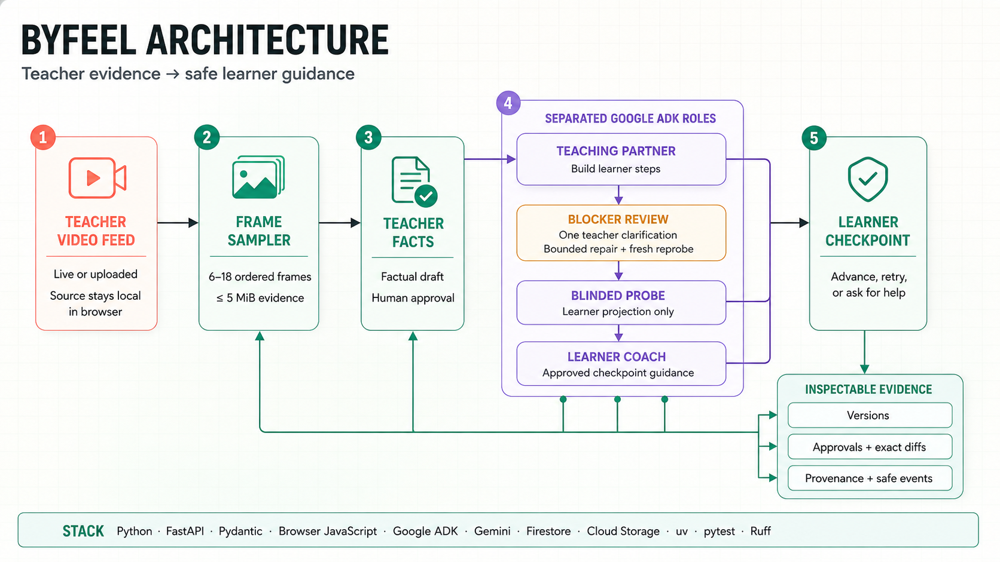

# ByFeel

ByFeel helps an expert’s know-how survive the handoff to a learner.

Experts often skip the small cues that feel “obvious” to them. ByFeel turns a
bounded demonstration into learner steps, tests those steps with a fresh
blinded probe, and lets a teacher approve one evidence-backed correction before
the learner sees updated guidance.

## See it first

- [Live demo](https://byfeel.ashutoshmishra.dev/)
- [GitHub repository](https://github.com/ASH1998/ByFeel)
- [Hackathon rules](https://allthingsagentichackathon.devpost.com/rules)

## Why this is different

ByFeel does not let an AI quietly invent the missing step. It keeps the source
video and teacher-only context out of the learner test, records the human
decisions, and requires every repair to point back to one teacher clarification.
That makes the result useful, reviewable, and safer to trust.

## How it works

1. **Capture:** a teacher uploads a short demonstration or uses the camera.
   The browser keeps the source video local and sends only a bounded set of
   frames for review.
2. **Approve facts:** the teacher checks the factual draft before it can become
   learner-facing instructions.
3. **Build and test:** the Teaching Partner creates learner steps. A new
   Blinded Probe sees only those steps and reports a blocker—or safely reports
   that none was found.
4. **Repair with permission:** the teacher reviews the blocker and supplies one
   clarification. ByFeel creates an exact, limited diff and runs a fresh probe.
5. **Guide the learner:** the Learner Coach checks an observable checkpoint and
   advances only when the learner’s state is ready.



## Tech stack, in plain English

- **Python, FastAPI, and Pydantic** — the API, rules, and data contracts.
- **Google ADK and Gemini** — three separated roles: Teaching Partner, Blinded
  Probe, and Learner Coach.
- **Browser JavaScript** — local video-frame sampling and the role-separated UI.
- **Firestore and Cloud Storage adapters** — namespaced evidence storage when
  cloud mode is explicitly enabled; local memory is the default.
- **uv, pytest, and Ruff** — repeatable setup, tests, and code checks.

## Run the local demo

Requirements: Python 3.12, [`uv`](https://docs.astral.sh/uv/), and Git.

```powershell
uv sync
Copy-Item .env.example .env
uv run byfeel serve
```

Open <http://127.0.0.1:8000> and choose **Load seeded rehearsal · 0 model
calls** for a deterministic walkthrough. It demonstrates the full teacher →
blind probe → review → repair → learner loop without sending a model request.

For the detailed media-ingestion, API, Gate A, Gate C, verification, and cloud
boundaries, see [docs/local-operations.md](docs/local-operations.md).

## Current status

This repository is a local mechanism-validation MVP. The seeded rehearsal is
synthetic and is clearly excluded from real evaluation evidence. Gate A still
needs a fresh real demonstration and human reliability review; the detailed
status and limits are documented below.

## Documentation map

- [Local operations and runbooks](docs/local-operations.md)
- [Judge-ready architecture](docs/judge-ready-architecture.md)
- [Four-minute demo script](docs/demo-script.md)
- [Hackathon compliance notes](docs/hackathon-compliance.md)
- [Project checklist](docs/project-checklist.md)
- [Decision Gate A](docs/decision-gate-a.md), [Gate B](docs/decision-gate-b.md),
  and [Gate C](docs/decision-gate-c.md)
- [Demonstration capture plan](docs/demonstration-capture-plan.md)
- [Firestore schema](docs/firestore-schema.md)
- [Towel-folding pilot notes](docs/towel-folding-pilot.md)

## Repository layout

```text
backend/   Python domain, services, persistence adapters, API, and UI
docs/      architecture, experiments, runbooks, and submission notes
scripts/   development and operational helpers
tests/     automated fake-model and application tests
```
