# Judge-ready architecture

Status: checkpoints 1–6 implemented locally, 2026-08-10. The architecture is
verified by 42 fake-model tests and a seeded browser rehearsal. It does not
claim Gate A has passed and does not authorize any cloud mutation, deployment,
or live Gemini call.

## Product invariant

Every user-visible path must preserve this sequence:

```text
teacher media
  -> teacher-only factual draft
  -> explicit human approval
  -> learner-facing procedure draft
  -> fresh learner-only probe
  -> immutable human blocker review
  -> zero or one clarification
  -> bounded repair from that answer only
  -> exact diff and fresh learner-only reprobe
  -> learner guidance from an approved version
```

An unblocked probe is a valid result. It must not be converted into a blocker to
make the demo more dramatic. Gate A remains incomplete until its separate real
demonstration protocol and final human reliability review are complete.

## Audit findings

The FastAPI application now provides typed teacher sessions, factual approval,
procedure/probe/repair/learner flows, immutable versions and reviews, safe ADK
run records, audit events, evidence storage, and in-memory or namespaced
Firestore-test adapters. The server-rendered browser separates Teacher, Blind
Probe, Learner, and Evidence modes. Teacher and learner sessions can resume
while repository state remains available.

Known remaining limits are explicit: in-memory state does not survive a server
restart, mutations do not yet have general idempotency keys, arbitrary media
processing remains synchronous, authentication is intentionally out of scope,
and no deployed Cloud Run backend exists. The official submission video must
eventually show a backend running on Google Cloud, which requires a later exact
deployment approval outside this goal.

The worktree contains existing user changes and ignored real-run artifacts.
They must be preserved. The ignored cloud ledger records 12 of the 18 Gate A
calls and actual later Gemini cost as unknown.

## Reuse decision

Extend the FastAPI application and its existing HTML/CSS/JavaScript client.
Do not introduce React for this milestone. A new frontend framework would add a
build toolchain and duplicate working API integration without materially
strengthening the closed loop.

Reuse:

- Pydantic domain schemas and application-owned validation;
- `GateAExperiment`, checkpoint evaluation, media ingestion, and evidence
  validation as domain/model adapters behind narrower interfaces;
- repository protocols plus in-memory and namespaced Firestore adapters;
- the existing FastAPI app factory and structured error envelope;
- the current main/Lite Gemini model routing;
- ignored run artifacts and cloud ledger as evidence, never learner context.

Change:

- make human approvals, procedure versions, ADK runs, safe audit events,
  idempotency records, and teacher sessions explicit domain records;
- split media draft, factual approval, extraction, probe, blocker review,
  clarification, repair, reprobe, and learner actions into individually guarded
  operations;
- replace the single-page fixture with role-separated views served by the same
  FastAPI application;
- add a deterministic seeded rehearsal path that is visibly labelled as local
  demo evidence and never counted as Gate A.

## ADK boundary

Google ADK 2.x is pinned through `uv` (`google-adk` currently resolves to
2.6.3). ADK is the orchestration layer, not the canonical state machine.

### Shared contract

Production ADK runs and fake test runs share scoped runtime protocols. Every
run returns a validated domain
result plus application-safe events:

- role, application run ID, isolated ADK session ID, and timestamps;
- model name and token counts when ADK exposes them;
- tool name, allow/deny decision, result status, and latency;
- human boundary IDs crossed before the run;
- no prompt text, hidden reasoning, credentials, raw media, teacher-only draft,
  or credential path.

### Teaching Partner

Use one ADK agent/runtime with a per-operation allowlist. Its tools are narrow
application functions, not arbitrary repository access:

- read one approved factual record;
- propose a learner procedure draft;
- read one reviewed candidate blocker;
- read the single verbatim clarification;
- propose a structured patch for the selected step and blocker;
- commit an application-validated procedure version and audit event.

The application performs lifecycle checks before a tool is made available. A
model cannot approve a factual record, accept a blocker, or publish a learner
version.

### Blinded Novice Probe

Construct a new probe agent, runner, and session for every probe and reprobe.
The factory accepts only a frozen `LearnerProcedure` projection and a generated
run ID. Its tool registry contains read-only learner-artifact and structured
blocker-report tools only. It receives no repository object and no general
Firestore, evidence, teacher-session, media, transcript, correction, previous
probe, or audit lookup tool.

The reprobe receives only the new learner projection. It does not reuse the
first probe session or reasoning. The application hashes and stores the exact
projection supplied to each run. Tests must plant sentinels in every excluded
teacher field and attempt direct and indirect tool access.

### Learner Coach

Use a separate learner-mode runtime and session. Its input is a frozen approved
procedure version, the current learner step, approved checkpoints and relevant
approved correction provenance, plus the learner's submitted observation or
snapshot. Tools may record a learner event, but cannot read teacher media,
unapproved procedure versions, probe reasoning, or hidden notes.

## Domain and persistence

Implemented application-owned records include:

- `TeacherSession` and teacher-only `MediaDraft`, with processing/error state;
- immutable `ApprovedDemonstration` referencing the exact approved factual hash;
- readiness states `draft`, `tested`, and `learner_ready`, plus explicit teacher
  session states for media review and factual approval;
- immutable `ProcedureVersion` with learner projection and content hash;
- immutable `BlockerReview` with genuine and false/optional classifications;
- one `TargetedClarification` per approved blocker, with verbatim answer;
- `RepairResult` restricted to the selected step with exact `source_quotes`;
- application-safe `AuditEvent` and `AgentRunRecord` envelopes.

General mutation idempotency keys remain unimplemented. Immutable approvals,
reviews, versions, and run IDs reject duplicates, but media/model operations
should not yet be retried blindly.

Bounded repair validation must be stronger than changed-step comparison. Each
added learner-facing claim must cite a `source_quote` that is an exact substring
of the single verbatim clarification. Only the reviewed blocker step and an
allowlist of learner-facing fields may change. The procedure ID, existing step
IDs/order, unrelated fields, and prior versions remain immutable. Any untraced
addition is rejected before persistence.

The in-memory repository remains the default. A local file-backed repository
may be added for restart-safe judge rehearsal without cloud access. Firestore
and Storage adapters remain restricted to
`byfeel_test_runs/{namespace}/...` and `test-data/{namespace}/...`; no production
paths, deletes, overwrites, indexes, policies, or resource configuration are in
scope.

## API shape

Implemented guarded operations include:

```text
POST /api/teacher/sessions
POST /api/teacher/sessions/{id}/media
GET  /api/teacher/sessions/{id}
POST /api/teacher/sessions/{id}/factual-approval
POST /api/teacher/sessions/{id}/extract
POST /api/probe-runs/{id}/review
POST /api/procedures/{id}/clarifications
POST /api/procedures/{id}/learner-approval
POST /api/learner/sessions
GET  /api/learner/sessions/{id}
POST /api/learner/sessions/{id}/checkpoints
GET  /api/judge/evidence/{procedure_id}
POST /api/demo/seeded-rehearsal
```

Conflict responses preserve immutable approvals and reviews. Full request-level
idempotency remains a documented limitation.

## Runtime diagram

```mermaid
flowchart LR
  T["Teacher video"] --> M["Bounded frame/audio observer"]
  M --> F["Teacher-only factual draft"]
  F --> H1["Exact human factual approval"]
  H1 --> TP["ADK Teaching Partner"]
  TP --> P1["Frozen learner projection"]
  P1 --> BP["Fresh ADK Blinded Probe"]
  BP --> H2["Immutable blocker review"]
  H2 -->|"genuine only"| C["One verbatim clarification"]
  C --> TP2["Provenance-checked ADK repair"]
  TP2 --> BP2["Fresh ADK reprobe"]
  BP2 --> H3["Exact learner-artifact approval"]
  H3 --> LC["ADK Learner Coach"]
  LC --> E["Checkpoint event + safe evidence timeline"]
```



## Browser experience

Serve one cohesive application shell with an always-visible role badge and four
routes/tabs:

1. **Teacher** — create/resume, upload bounded video, choose spoken/silent,
   inspect processing state, review synchronized frames/actions/spoken words,
   approve the factual record, and review/edit the procedure draft.
2. **Probe & repair** — show the exact learner artifact and an explicit exclusion
   manifest, classify the result, capture immutable human review, ask at most one
   question, show verbatim answer and exact diff, then run a fresh reprobe.
3. **Learner** — show only the approved current step and checkpoint, capture an
   event-driven image, and render advance/block/retry/another-view/human outcomes.
4. **Evidence** — concise read-only timeline for roles, safe tool/model events,
   versions, diffs, approvals, blindness hashes, calls/tokens, verified cost only,
   Gate A status, and limitations.

Empty, loading, timeout, retry, and failure states are part of each operation,
not a separate admin dashboard. Basic labels, keyboard behavior, focus styles,
status announcements, and readable contrast are mandatory.

## Seeded rehearsal

The local seed endpoint creates a non-secret deterministic in-memory fixture
with a blocked -> reviewed -> repaired -> fresh unblocked history and one
learner error/recovery. It makes no model calls, stores no fake ADK run, and the
UI labels it **0 model calls** and **excluded from Gate A**. Its audit timeline
records that limitation explicitly.

## Validation order

1. Application-level approval and lifecycle tests, including the current API
   repair bypass.
2. ADK tool allowlist, fresh-session, projection-hash, and leakage tests using
   fake models/runners only.
3. Media API and factual-approval tests.
4. Procedure version, exact diff, source-quote, idempotency, and append-only
   history tests.
5. Learner policy and checkpoint tests.
6. API, browser accessibility, seeded rehearsal, and manual smoke tests.
7. Full `pytest`, Ruff lint, Ruff format, and any added frontend checks.

No live Gemini run is required for Checkpoints 1–6. The remaining six Gate A
calls stay reserved for approved real-demonstration work.
